Duke Music Library Circulation and Item Analysis
================
Team TwoSquared - Radu Vasilescu, Merle Nye, Winston Yau, Eddy Lin
2019-04-17

## Introduction

This project will focus on a dataset consisting of materials circulation
records from the Duke University Music Library. The Duke Music Library
has a large collection of materials, consisting of musical scores, music
literature and theory books, CDs, DVDs, microfilms, vinyl records, and
others. The majority of materials are available to circulate among
students, grad students, faculty members, and other members of the
library. The central library circulation software, ALEPH, keeps records
of every single circulation transaction (check-out, loans, returns,
missing items, etc.), and historical data is available for the past
several years of activity.

With this data, we hope to answer questions that will allow us to
present recommendations to the music libraries to help them make their
transaction processes more efficient. We hope to explore the factors
that predict transactions so that we may make inferences about the data.
One question might be what features are typical of the most commonly
loaned publications. We can also examine data such as the time it takes
for publications on hold to be delivered to the holders to analyze the
inefficiencies of the current system. These inefficiencies will allow us
to offer our recommendations on the storage of items and processing of
transactions to save the libraries time and money.

We obtained the dataset using ARC, the library’s reporting software,
with permission and guidance from Dr. Jamie Keesecker, Laura Williams,
John Little, and Karen Newbery. The data is sanitized and cleaned of any
personally identifiable patron information, and is therefore safe and
permissible to be used for this project.

There are approximately 176,000 records in the transaction log in the
time interval we selected (Jan 1, 2014 thru Jan 1, 2019), and each
record represents one circulation transaction.

**NOTE: Please make sure you have the latest version of packages
installed.** Go to Tools \> Check for Package Updates, and install all
of them. Especially make sure you are on `forcats` version `0.4.0` or
higher, otherwise you’ll encounter problems with `fct_collapse(...,
group_other = TRUE)`.

\*\*NOTE2: We have decided to only perform 100 reps because of
RStudioCloud’s software limitation, and performing any number beyond 100
reps will crash the software.

This is the current format of the dataset:

    ## Observations: 176,011
    ## Variables: 28
    ## $ date_time        <dttm> 2018-04-13 00:20:00, 2018-09-28 00:20:00, 2017…
    ## $ specific_date    <date> 2018-04-13, 2018-09-28, 2017-05-05, 2014-10-03…
    ## $ year             <dbl> 2018, 2018, 2017, 2014, 2017, 2017, 2014, 2018,…
    ## $ month            <dbl> 4, 9, 5, 10, 10, 10, 11, 11, 6, 11, 4, 11, 6, 5…
    ## $ date             <int> 13, 28, 5, 3, 27, 27, 14, 30, 22, 13, 25, 18, 1…
    ## $ day              <fct> Friday, Friday, Friday, Friday, Friday, Friday,…
    ## $ hour             <dbl> 0, 0, 0, 0, 0, 0, 0, 0, 0, 0, 0, 0, 0, 0, 0, 0,…
    ## $ minute           <dbl> 20, 20, 23, 21, 27, 25, 21, 20, 23, 21, 23, 29,…
    ## $ sub_library      <fct> Library Service Center, Library Service Center,…
    ## $ event_type       <fct> Return, Return, Return, Return, Return, Return,…
    ## $ event_category   <fct> return, return, return, return, return, return,…
    ## $ status_on_event  <fct> Standard Loan, Standard Loan, Standard Loan, St…
    ## $ process_id       <fct> DP, DP, DP, DP, DP, DP, DP, DP, DP, DP, DP, DP,…
    ## $ process_desc     <fct> LSC, LSC, LSC, LSC, LSC, LSC, LSC, LSC, LSC, LS…
    ## $ collection_id    <fct> PSM, PSM, PSM, PSMV, PSMV, PSMV, PSMV, PSMV, PS…
    ## $ collection_desc  <fct> NA, NA, NA, NA, NA, NA, NA, NA, NA, NA, NA, NA,…
    ## $ format           <fct> Books, Books, Books, Music, Music, Music, Music…
    ## $ barcode          <fct> D04507510M, D04926284Z, D048887923, D04107305K,…
    ## $ ISBN             <chr> "9780062069030 (hbk.)", "9780415873253 (hardbac…
    ## $ title            <chr> "Satan is real :", "That's the joint! :", "Word…
    ## $ topic            <fct> ML0-ML9999Z: Literature on Music, ML0-ML9999Z: …
    ## $ topic_category   <fct> Other, Other, Other, NA, Other, NA, Other, NA, …
    ## $ language         <fct> English, English, English, English, No linguist…
    ## $ publication_date <dbl> 1975, 1975, 1975, 1975, 1975, 1975, 1975, 1975,…
    ## $ arrival_date     <dttm> NA, NA, NA, NA, NA, NA, NA, NA, NA, NA, NA, NA…
    ## $ patron_type      <fct> Other - Miscellanous, Other - Miscellanous, Oth…
    ## $ patron_category  <fct> Other, Other, Other, Other, Other, Other, Other…
    ## $ patron_status    <fct> Dummy, Dummy, Dummy, Dummy, Dummy, Dummy, Dummy…

### Inventory Catalog

From the circulation history data, we also built a catalog of all of the
unique information about each item in the library.

    ## Observations: 35,708
    ## Variables: 14
    ## $ barcode          <fct> D04507510M, D04926284Z, D048887923, D04107305K,…
    ## $ sub_library      <fct> Library Service Center, Library Service Center,…
    ## $ process_id       <fct> DP, DP, DP, DP, DP, DP, DP, DP, DP, DP, DP, DP,…
    ## $ process_desc     <fct> LSC, LSC, LSC, LSC, LSC, LSC, LSC, LSC, LSC, LS…
    ## $ collection_id    <fct> PSM, PSM, PSM, PSMV, PSMV, PSMV, PSMV, PSMV, PS…
    ## $ collection_desc  <fct> NA, NA, NA, NA, NA, NA, NA, NA, NA, NA, NA, NA,…
    ## $ format           <fct> Books, Books, Books, Music, Music, Music, Music…
    ## $ ISBN             <chr> "9780062069030 (hbk.)", "9780415873253 (hardbac…
    ## $ title            <chr> "Satan is real :", "That's the joint! :", "Word…
    ## $ topic            <fct> ML0-ML9999Z: Literature on Music, ML0-ML9999Z: …
    ## $ topic_category   <fct> Other, Other, Other, NA, Other, NA, Other, NA, …
    ## $ language         <fct> English, English, English, English, No linguist…
    ## $ publication_date <dbl> 1975, 1975, 1975, 1975, 1975, 1975, 1975, 1975,…
    ## $ arrival_date     <dttm> NA, NA, NA, NA, NA, NA, NA, NA, NA, NA, NA, NA…

## Data Visualizations

### Inventory Visualizations

Here’s a quick breakdown of the inventory size and distribution for the
two different sub-libraries. For clarity, first, here’s a summary of the
number of items of each type across the two libraries:

    ## # A tibble: 10 x 3
    ## # Groups:   sub_library, format [10]
    ##    sub_library            format               n
    ##    <fct>                  <fct>            <int>
    ##  1 Music Library          Books            12128
    ##  2 Music Library          Computer files       5
    ##  3 Music Library          Music            16800
    ##  4 Music Library          Serials            167
    ##  5 Music Library          Visual materials   857
    ##  6 Library Service Center Books             2169
    ##  7 Library Service Center Computer files       2
    ##  8 Library Service Center Music             2948
    ##  9 Library Service Center Serials            582
    ## 10 Library Service Center Visual materials    50

And now, in graph form:

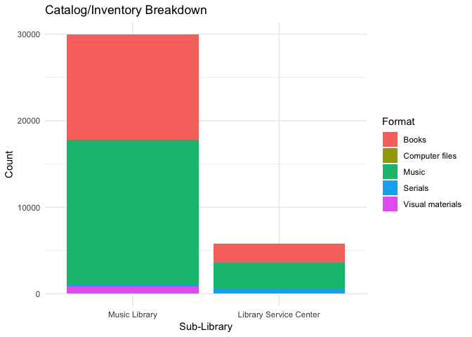<!-- -->

### Circulation Visualizations

Let’s try plotting some visualizations about the inventory size across
different types/formats of materials, and then looking at the amount of
circulation activity for each type of material:

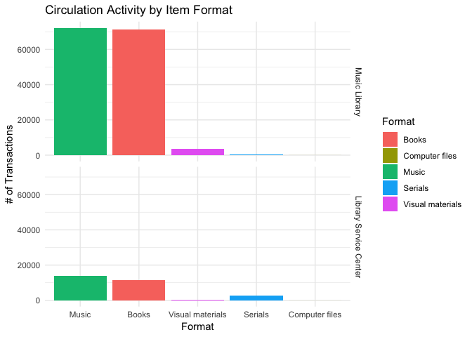<!-- -->

The main players, obviously, are the `Books` and `Music` (sheet music)
materials, making up the vast majority of circulation transactions in
both the music library and the LSC.

### Trends Over Time

How has circulation changed over time? What trends can we see in the
types of borrowers and their activity over the last few years? Here’s a
quick sketch using one point one per day and applying a smoothing to the
curve:

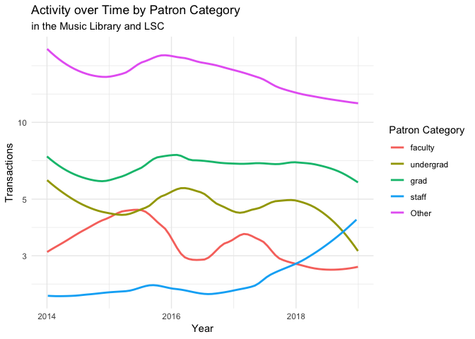<!-- -->

### Activities by Time of Day

The music library hires students to work behind the circulation desk,
helping patrons and library staff manage the workload during the busy
parts of the day. By analyzing patterns in activity over the course of
the day, we may arrive at some useful conclusions that could help staff
schedule workers more efficiently and effectively.

*Note*: In this plot, the opening and closing times of the music library
are marked by vertical blue lines.

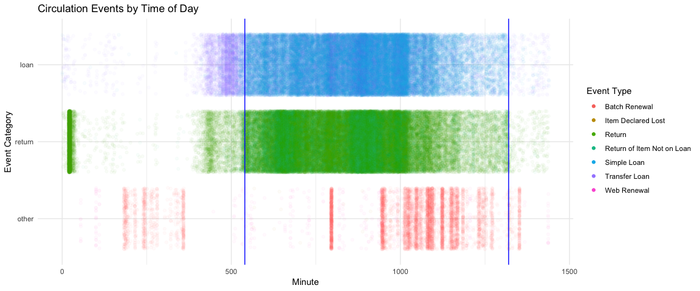<!-- -->

## Optimizing the Library Service Center

Books that must be retrieved and mailed from the LSC to the Music
Library when requested are less efficient, as this process can take a
few days. Perhaps, by implementing some sort of caching system based on
temporal and/or spatial locality, we can optimize the retrieval time for
materials by maximizing the “hit” rate in the on-campus library stacks.
This is similar to the way a CPU core uses a heirarchy of caches (L1,
L2, etc.) to increase performance when accessing values from RAM.

Another way of thinking about it as using the library analogy itself:
reaching for items that are far away is not as efficient as having a
separate holding area that holds the most popular items that is easy to
access.

Since simulating and analyzing such a system would be very complicated
and significantly beyond the scope of this project, we will approximate
the stateful cache with a state-less, deterministic 1-time
reorganization of materials. We’ll generate two scenarios– one in which
items are arranged among the stacks and LSC as they currently are, and
one in which items are rearranged according to the demand ranking system
described above. Then, we’ll run statistical simulations on these
scenarios to determine if the optimized arrangement yields a
statistically significant improvement in access time.

### Predicting Demand of Items

We are going to attempt to fit a model to estimate the demand of a given
library item based on the following possible variables:

  - `sub_library`: (deterministically related to `process_id` and
    `process_desc` variables) where the book currently is stored might
    have an impact on how likely an item is requested, as those who see
    the items in the stacks of the music library might decide to request
    the item. This variable is important for the simulation (later), but
    will not be directly used in the model.
  - `collection_id`: the library collection to which the item belongs
  - `format`: the format of the item (ex. `"Books"`, `"Music"`, etc.)
  - `topic_category`: a simplified categorization of general subject
    matter
  - `language`: the language of a book will probably influence its
    popularity; perhaps the most widely-spoken languages will be the
    most popular.

First, we have to count the number of requests for each item in the
catalog (our dependent variable):

Here’s a histogram plot that shows the distribution of the number of
times each item has been requsted:

    ## Warning: Transformation introduced infinite values in continuous x-axis

    ## Warning: Removed 6574 rows containing non-finite values (stat_bin).

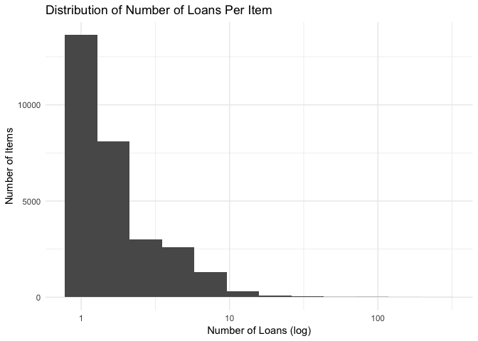<!-- -->

#### Linear Model

First, we will fit the full model to the data. One of the considerations
we have with the dataset is how to deal with NA values in the data. We
know that fitting the model will automatically do a listwise deletion,
removing the rows/observations from the data that contain NAs for the
variables being used in the model.

After removing those variables with significant missing values, we fit a
linear model to try to predict the number of requests based on the
item’s information.

    ## # A tibble: 88 x 5
    ##    term               estimate std.error statistic   p.value
    ##    <chr>                 <dbl>     <dbl>     <dbl>     <dbl>
    ##  1 (Intercept)       -368.       237.      -1.55   1.20e-  1
    ##  2 collection_idPM2     0.0337     0.378    0.0892 9.29e-  1
    ##  3 collection_idPM9    -0.416      2.48    -0.168  8.67e-  1
    ##  4 collection_idPMF    -0.0243     0.177   -0.137  8.91e-  1
    ##  5 collection_idPML    -0.557      0.371   -1.50   1.34e-  1
    ##  6 collection_idPMLF   -0.430      1.24    -0.347  7.29e-  1
    ##  7 collection_idPMMS   -0.131      0.137   -0.955  3.39e-  1
    ##  8 collection_idPMR    -1.38       0.219   -6.28   3.43e- 10
    ##  9 collection_idPMV     0.899      0.570    1.58   1.15e-  1
    ## 10 collection_idPMX     7.81       0.249   31.4    1.43e-212
    ## # … with 78 more rows

    ## # A tibble: 1 x 11
    ##   r.squared adj.r.squared sigma statistic p.value    df  logLik    AIC
    ##       <dbl>         <dbl> <dbl>     <dbl>   <dbl> <int>   <dbl>  <dbl>
    ## 1    0.0927        0.0895  3.50      28.9       0    88 -65867. 1.32e5
    ## # … with 3 more variables: BIC <dbl>, deviance <dbl>, df.residual <int>

This linear model is not great, with an adjusted R-squared value of only
0.0895359.

Let’s try to optimize the model using AIC-based backwards selection:

    ## Start:  AIC=61928.06
    ## num_requests ~ collection_id + format + topic_category + publication_date + 
    ##     language
    ## 
    ##                    Df Sum of Sq    RSS   AIC
    ## - topic_category    5      30.7 301697 61921
    ## <none>                          301666 61928
    ## - publication_date  1      30.0 301696 61929
    ## - format            3    1217.5 302884 62021
    ## - collection_id    13   12868.8 314535 62932
    ## - language         65   15122.5 316789 63004
    ## 
    ## Step:  AIC=61920.57
    ## num_requests ~ collection_id + format + publication_date + language
    ## 
    ##                    Df Sum of Sq    RSS   AIC
    ## <none>                          301697 61921
    ## - publication_date  1      30.6 301728 61921
    ## - format            3    1195.6 302893 62012
    ## - collection_id    13   12955.7 314653 62931
    ## - language         65   15136.8 316834 62998

    ## # A tibble: 1 x 11
    ##   r.squared adj.r.squared sigma statistic p.value    df  logLik    AIC
    ##       <dbl>         <dbl> <dbl>     <dbl>   <dbl> <int>   <dbl>  <dbl>
    ## 1    0.0927        0.0896  3.50      30.6       0    83 -65868. 1.32e5
    ## # … with 3 more variables: BIC <dbl>, deviance <dbl>, df.residual <int>

This is our best model, with only variables `publication date`,
`format`, `collection_id`, and `language` included in it, meaning that
only these four variables have a significant impact on the number of
loan requests.

The best model’s final R-squared value is 0.0926558.

    ## # A tibble: 83 x 5
    ##    term               estimate std.error statistic   p.value
    ##    <chr>                 <dbl>     <dbl>     <dbl>     <dbl>
    ##  1 (Intercept)       -371.       237.      -1.57   1.17e-  1
    ##  2 collection_idPM2     0.0297     0.378    0.0786 9.37e-  1
    ##  3 collection_idPM9    -0.414      2.48    -0.167  8.67e-  1
    ##  4 collection_idPMF    -0.0270     0.177   -0.152  8.79e-  1
    ##  5 collection_idPML    -0.557      0.371   -1.50   1.33e-  1
    ##  6 collection_idPMLF   -0.436      1.24    -0.352  7.25e-  1
    ##  7 collection_idPMMS   -0.136      0.137   -0.993  3.21e-  1
    ##  8 collection_idPMR    -1.37       0.219   -6.27   3.79e- 10
    ##  9 collection_idPMV     0.896      0.570    1.57   1.16e-  1
    ## 10 collection_idPMX     7.81       0.249   31.4    1.41e-212
    ## # … with 73 more rows

### Evaluate LSC/Stacks Performance

Now, we are going to run a simulation to determine the existing
performance/efficiency of the system.

To do this, we are going to use a bootstrap simulation to find the
proportion of requests that found books in the Stacks rather than in the
LSC– the “hit rate”.

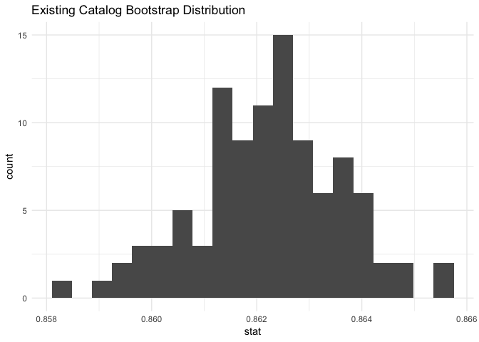<!-- -->

The median value produced by this bootstrap simulation is 0.8622734.
This value represents the expected proportion of requests that
constitute a “hit”– the requested item can be found in the Stacks, and
does not need to be shipped from the LSC.

Now, we are going to try to increase this by using our model to
re-arrange the items between the stacks and the LSC to try achieve a
higher hit rate.

### Optimize the LSC/Stacks Distribution

First, we have to get the predicted number of requests (demand) of each
item using the model we created and optimized above.

    ##       barcode num_requests predicted_num_requests
    ## 1  D04507510M            3                      2
    ## 2  D04926284Z            9                      2
    ## 3  D048887923           16                      2
    ## 4  D04634076U            2                      1
    ## 5  D04107352M            3                      2
    ## 6  D04634015N            2                      1
    ## 7  D04782939%            1                      1
    ## 8  D05129922U            1                      1
    ## 9  D05141515M            1                      0
    ## 10 D04725249X            2                      1

Let’s make a visualization to test the accuracy of these predictions:

    ## Warning: Transformation introduced infinite values in continuous y-axis

    ## Warning: Removed 30 rows containing missing values (geom_bar).

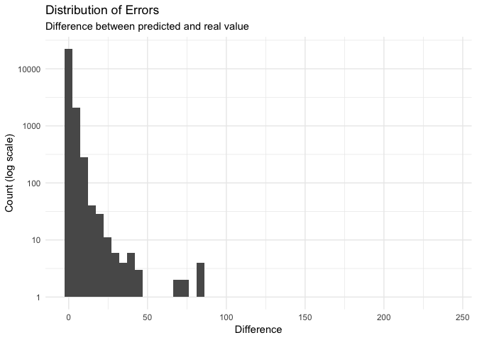<!-- --> In
the graph, the differences in values between the predicted and actual
values are mostly very small for the majority of oru predictions, and
there is a steep decrease in the number of predictions once the
difference in values got larger.

Now, we have to use the predicted value to create a new distribution of
items between the stacks and the LSC. To do this, we’ll first sort the
predicted catalog by `predicted_num_requests`, and then assign the
`sub_library` of the first *n* items to be `"Music Library"`, and the
rest to be `"Library Service Center"`, where *n* corresponds to the
proportion of catalog items that were originally in the Music Library
(to maintain the same proportion across locations).

We also have to create a new `music_circ` dataframe to hold the loan
requests etc., but with the newly assigned `sub_library` values. We’ll
make sure to filter out all of the `NA`-containing values from this as
well.

### Evaluate Optimized LSC/Stacks Performance

Now, we’ll use the same process from before, to evaluate the
performance/efficiency of this newly distributed catalog.

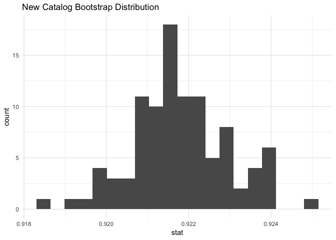<!-- -->

The new median hit rate using the re-distributed catalog is 0.9216932.

### Comparing Original vs. Optimized Performance

First, we can see how the new organization of the libraries’ items
performed compared to the existing organization. We can plot the hit
rates of each one on a bar plot.

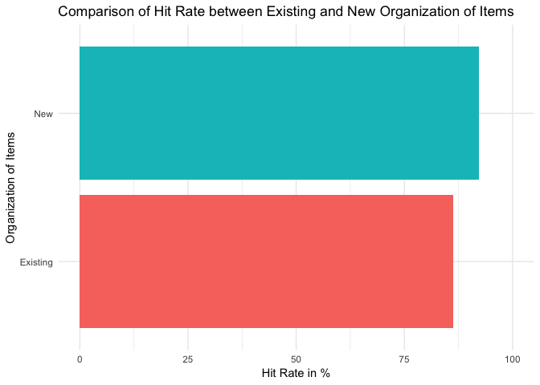<!-- -->

Now, we have to formally compare the performance of the original library
assignment versus our optimized assignment strategy. To do this, we will
run a hypothesis test:

  - H0: Hit-rate(optimized) == Hit-rate(original) - There is
    no change.
  - HA: Hit-rate(optimized) \> Hit-rate(original) - The
    optimized version has a higher hit rate.

This is an independence test, so we will use an `"independence"`
hypothesis with the `"permute"` method, and calculate the `"diff in
props"` stat.

*Note*: We must also group the two circulation logs into one data frame,
with a new variable representing whether or not that transaction was
optimized by our model.

First, we have to determine the observed difference in proportions
between the optimized and un-optimized catalogues:

    ## [1] 0.07129802

Now, we can run the simulation.

Let’s visualize the resulting null distribution, with a vertical line
representing the observed difference in proportions:

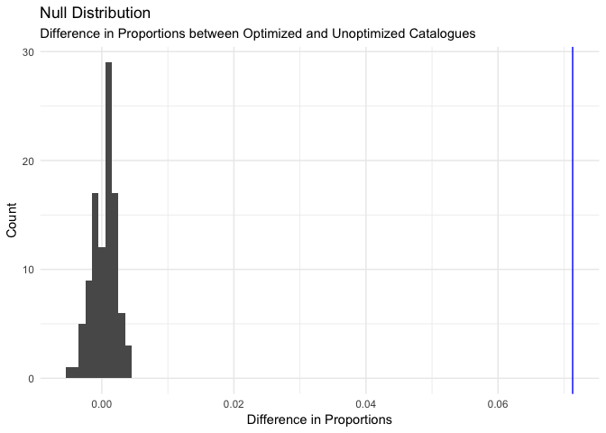<!-- -->

We can then calculate our p-value as the probability that the observed
difference in hit rates occurred by chance:

    ## [1] 0

Since our P-value is 0, which is less than 0.05, we can reject the null
hypothesis. This means that there is very likely a significant increase
in the “hit”-proportion of our optimized catalog when compared to the
existing baseline catalog.

## Conclusion

### Motivation and Relevance

The initial motivation for this project was from one of the group
member’s (Radu’s) experience working at the music library. He
recognized some inefficiencies in the process during his work there and
wanted to employ data analysis of the detailed library transaction and
catalog records to optimize the system. Overall, our goal was to
construct a model to save patrons’ valuable time and the library money
for loan requests, an essential service provided by the library. During
our analysis, we built a model that achieved these goals.

### Results

As our P value in the above test illustrates, our model for material
placement in the library performs significantly more efficiently than
the current system. According to our simulation, the optimized catalogue
preforms 12.8% more efficiently. This means that if implemented, 12.8%
more patrons who currently request items from the library will have
their items readily available and forgo the three-day wait associated
with retrieving items from the library service center.

From the libraries’ perspective, this efficiency gain represents huge
cost-saving potential. There were 33,296 loan requests in 2018.
According to our simulation, that means about 4,994 items had to be
brought from the library service center. The director of the library
estimates that each item costs about a dollar to ship from the Library
Service Center to the music library when it’s requested due to costs
associated with driver wage, gas, and vehicle costs. Given that
estimate, the library spends around $4,994 per year on retrieving books
from the LSC. If the library were to use our model, they would only need
to spend about $2,664 per year to transport requested materials.

The one-time redistribution of items would also be a sizeable cost, but
it would be weighed out by the future savings. Since our model suggest
moving about 5838 items, at $0.50 per item that would mean a one-time
cost of about $2919. Let’s see how that would look over several years:

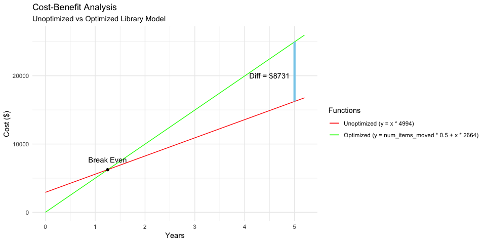<!-- -->

As we can see from this visualization, performing the one-time
redistribution of items according to our model would result in positive
savings after a little over 1 year. After 5 years, the optimized library
would have saved about $8731 compared to the unoptimized system.

Thus, we have shown how the music library stands to benefit both
financially and through increased efficiency by using our model to
reorganize the distribution of their catalogue.

### Future Improvement

The linear model used in this project was not extremely accurate. If we
were to do this project again, we would probably try to research other
ways of creating a more accurate model for the data, perhaps using a
more advanced type of regression or some kind of machine learning
technique.

In addition, in future iterations of the project, we would perform a
k-fold cross validation to analyze the variance of the model, or how it
responds to new data (and not just bias, or how well it fits training
data). We’d need a more clearly defined policy for dealing with missing
values, since we had to remove about 10,000 items that had missing
bibliographical information used in our model.

Another area of improvement could definitely be using a more accurate
dataset for the catalog of items. Since we built the catalog by just
looking at unique barcodes from the circulation log, the catalog that we
have only includes items that were requested at least once in the
four-year period. In reality, according to our source at the music
library, the Library Service Center holds over 100,000 music-related
materials, and the library’s stacks hold about 80,000 materials on-site.
A more complete catalog would allow us to be more accurate in the
distribution of items among the two sites by giving us an accurate value
for the proportion of items in each location.
