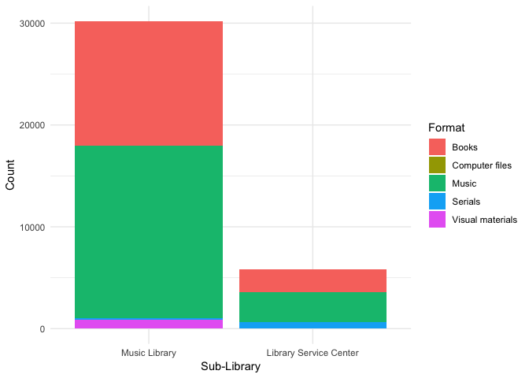
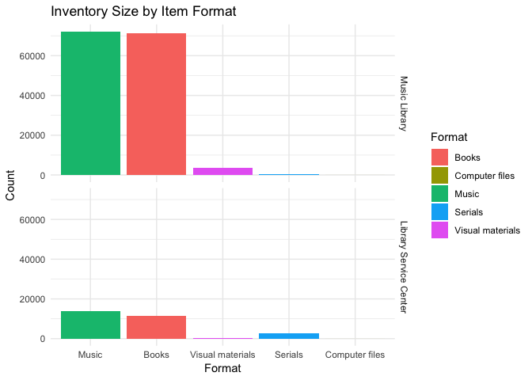
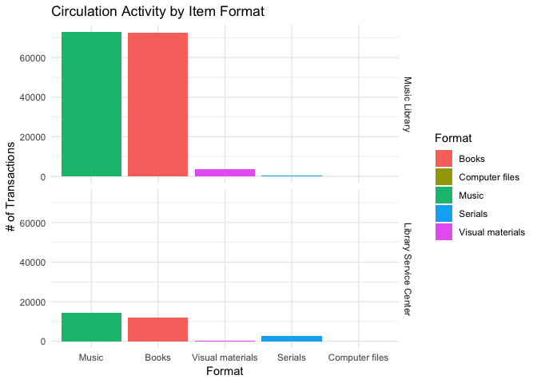
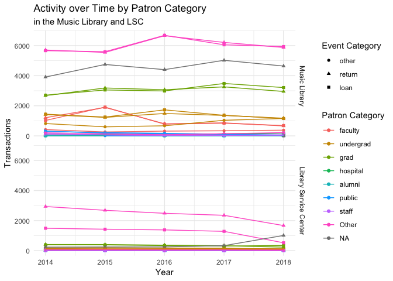
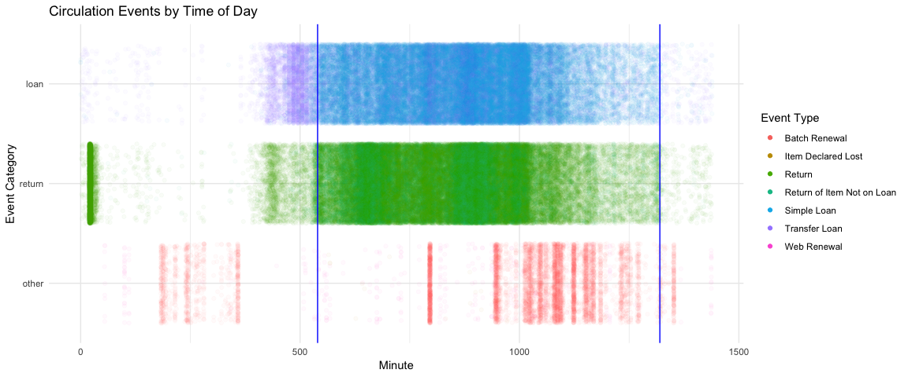

Duke Music Library Circulation and Item Analysis
================
Team TwoSquared - Radu Vasilescu, Merle Nye, Winston Yau, Eddy Lin
21 March 2019

## Section 1. Introduction

This project will focus on a dataset consisting of materials circulation
records from the Duke University Music Library. The Duke Music Library
has a large collection of materials, consisting of musical scores, music
literature and theory books, CDs, DVDs, microfilms, vinyl records, and
others. The majority of materials are available to circulate among
students, grad students, faculty members, and other members of the
library. The central library circulation software, ALEPH, keeps records
of every single circulation transaction (check-out, loans, returns,
missing items, etc.), and historical data is available for the past
several years of activity.

With this data, we hope to answer questions that will allow us to
present recommendations to the music libraries to help them make their
transaction processes more efficient. We hope to explore the factors
that predict transactions so that we may make inferences about the data.
One question might be what features are typical of the most commonly
loaned publications. We can also examine data such as the time it takes
for publications on hold to be delivered to the holders to analyze the
inefficiencies of the current system. These inefficiencies will allow us
to offer our recommendations on the storage of items and processing of
transactions to save the libraries time and money.

We obtained the dataset using ARC, the library’s reporting software,
with permission and guidance from Dr. Jamie Keesecker, Laura Williams,
John Little, and Karen Newbery. The data is sanitized and cleaned of any
personally identifiable patron information, and is therefore safe and
permissible to be used for this project.

There are approximately 176,000 records in the transaction log in the
time interval we selected (Jan 1, 2014 thru Jan 1, 2019).

Each record represents one circulation transaction. In order to see what
kinds of data and variables are provided, let’s first load and clean the
data.

### Load Packages and Data

``` r
library(tidyverse)
library(lubridate)
library(broom)
library(forcats)

theme_set(theme_minimal())
```

``` r
music_circ <- read_csv("../data/music-circ.csv") %>% filter(`Event Year` < 2019)
```

    ## Warning: Duplicated column names deduplicated: 'Event Day' => 'Event
    ## Day_1' [25]

Now, we will use `tidyverse` commands to clean up the data into a good,
clean format for exploratory analysis:

``` r
music_circ <- music_circ %>%
    rename(year = `Event Year`) %>%
    rename(month = `Event Month`) %>%
    rename(date = `Event Date`) %>%
    rename(day = `Event Day`) %>%
    rename(hour= `Event Hour`) %>%
    rename(minute = `Event Minute`) %>%
    rename(event_type = `Event Type Desc`) %>%
    rename(sub_library = `Sub Library Desc`) %>%
    rename(status_on_event = `Item Status Desc on Event`) %>%
    rename(process_id = `Process Status ID`) %>%
    rename(process_desc = `Process Status Desc`) %>%
    rename(collection_id = `Collection ID`) %>%
    rename(collection_desc = `Collection Desc`) %>%
    rename(format = `Format Desc`) %>%
    rename(barcode = Barcode) %>%
    rename(title = Title) %>%
    rename(topic = `Topic Name`) %>%
    rename(language = `Language Desc`) %>%
    rename(publisher = `Publisher`) %>%
    rename(publication_date = `Publication Date`) %>%
    rename(arrival_date = `Arrival Year and Month`) %>%
    rename(patron_type = `Patron Type Desc`) %>%
    rename(patron_status = `Patron Status Desc`)

music_circ <- music_circ %>%
    mutate(date = mdy_hm(date) %>% day()) %>%
    mutate(date_time = make_datetime(year, month, date, hour, minute)) %>%
    mutate(day = factor(day) %>% fct_relevel("Monday", "Tuesday", "Wednesday", "Thursday", "Friday", "Saturday", "Sunday")) %>%
    mutate(sub_library = fct_rev(factor(sub_library))) %>%
    mutate(event_type = factor(event_type)) %>%
    mutate(event_category = fct_collapse(event_type, 
                                         return = c("Return", "Return of Item Not on Loan"),
                                         loan = c("Simple Loan", "Transfer Loan"),
                                         other = c("Batch Renewal", "Item Declared Lost", "Web Renewal"))) %>%
    
    mutate(status_on_event = factor(status_on_event)) %>%
    mutate(process_id = factor(process_id)) %>%
    mutate(process_desc = factor(process_desc)) %>%
    mutate(collection_id = factor(collection_id)) %>%
    
    mutate(collection_home = fct_collapse(collection_id,
                                          music = c("PM", "PM2", "PM4", "PM9", "PMC", "PMF", "PML", "PMLF", "PMMC", "PMMCC", "PMMCM", "PMMCX",
                                                    "PMMS", "PMR", "PMRC", "PMT", "PMV", "PMVX", "PMX"),
                                          lsc = c("PSM", "PSMC", "PSMM", "PSMP", "PSMV"))) %>%
    mutate(format = factor(format)) %>%
    mutate(barcode = factor(barcode)) %>%
    mutate(topic = factor(topic)) %>%
    mutate(topic_category = fct_collapse(topic, 
                                         music_lit = c("780-780.09Z: Literature on Music", 
                                                   "780.2-780.6Z: Literature on Music", 
                                                   "780.72-780.75Z: Literature on Music", 
                                                   "780.78-780.79Z: Literature on Music", 
                                                   "780.8-780.9Z: Literature on Music",
                                                   "781.1-781.27Z: Literature on Music",
                                                   "781.45-781.46Z: Literature on Music", 
                                                   "781.8-781.9Z: Literature on Music",
                                                   "784-784.09Z: Literature on Music", 
                                                   "784.18-784.19Z: Literature on Music", 
                                                   "789-789Z: Literature on Music",
                                                   "ML0-ML9999Z: Literature on Music"),
                                                   
                                         music_instruction = c("780.1-780.1Z: Music Instruction & Study", 
                                                               "780.7-780.71Z: Music Instruction & Study",
                                                               "780.76-780.77Z: Music Instruction & Stud",
                                                               "781-781.09Z: Music Instruction & Study",
                                                               "781.28-781.29Z: Music Instruction & Stud", 
                                                               "781.3-781.31Z: Music Instruction & Study",
                                                               "781.33-781.39Z: Music Instruction & Stud", 
                                                               "781.4-781.42Z: Music Instruction & Study",
                                                               "MT0-MT9999Z: Music Instruction & Study"),
                                         
                                         music_instrumental = c("781.54-781.54Z: Instrumental Music",
                                                                "781.554-781.554Z: Instrumental Music",
                                                                "781.63-781.63Z: Instrumental Music",
                                                                "781.65-781.65Z: Instrumental Music",
                                                                "784.1-784.17Z: Instrumental Music",
                                                                "784.2-784.9Z: Instrumental Music", 
                                                                "785-788Z: Instrumental Music", 
                                                                "M5-M1490Z: Instrumental Music"),
                                         
                                         music_vocal = c("781.59-781.59Z: Vocal Music", 
                                                   "781.6-781.62Z: Vocal Music", 
                                                   "781.64-781.64Z: Vocal Music", 
                                                   "781.66-781.67Z: Vocal Music", 
                                                   "781.7-781.7Z: Vocal Music", 
                                                   "782-782.97Z: Vocal Music", 
                                                   "783-783Z: Vocal Music",
                                                   "M1495-M2199Z: Vocal Music"),
                                         
                                         music_gen = c("781.5-781.53Z: General Music",
                                                       "781.56-781.58Z: General Music",
                                                       "781.68-781.69Z: General Music",
                                                       "M0-M4Z: General Music"),
                                         group_other = TRUE)) %>%
    mutate(language = factor(language)) %>%
    mutate(publication_date = year(as_date(publication_date))) %>%
    mutate(arrival_date = parse_date_time(arrival_date, "y m")) %>%
    mutate(patron_type = factor(patron_type)) %>%
    mutate(patron_category = fct_collapse(patron_type, 
                                          faculty = c("Faculty - Emeritus", "Faculty - Music", "Faculty - Divinity", "Faculty - DUMC",
                                                      "Faculty - Law", "Faculty - General", "Faculty - Fuqua", "Faculty - Visiting Faculty"),
                                          
                                          undergrad = c("Undergraduate"),
                                          grad = c("Grad - BES", "Grad - Divinity", "Grad - DUMC", "Grad - Engineering & CompSci", 
                                                   "Grad - Fuqua MBA", "Grad - Fuqua MMS", "Grad - Fuqua PhD", "Grad - Fuqua Weekend MBA",
                                                   "Grad - General", "Grad - Law", "Grad - Marine Lab", "Grad - Math/Physics",
                                                   "Grad - Religion"),
                                          
                                          hospital = c("Hospital - Administrative/Clerical", "Hospital - Clinical/Technical", 
                                                       "Hospital - House Staff", "Hospital - Staff Nurse", "Hospital - Undefined"),
                                          
                                          alumni = c("Other - Alumni", "Other - Fuqua Alumni", "Other - Law Alumni"),
                                          
                                          public = c("Other - Durham Resident", "Other - Family", "Other - Friends of the Library", 
                                                     "Other - Guest", "Other - Retired Staff"),
                                          
                                          staff = c("Staff - BES", "Staff - Engineering & CompSci", "Staff - General", "Staff - Library Staff",
                                                    "Staff - Math/Physics Staff"),
                                          
                                          group_other = TRUE)) %>%
    mutate(patron_status = factor(patron_status)) %>%
    select(date_time, year, month, date, day, hour, minute,
           sub_library, event_type, event_category, status_on_event, process_id, process_desc, collection_id, collection_desc,
           format, barcode, ISBN, title, topic, topic_category, language, publication_date, arrival_date, patron_type, patron_category,
           patron_status)
```

This is the current format of the dataset:

``` r
music_circ %>% glimpse()
```

    ## Observations: 176,011
    ## Variables: 27
    ## $ date_time        <dttm> 2018-04-13 00:20:00, 2018-09-28 00:20:00, 20...
    ## $ year             <int> 2018, 2018, 2017, 2014, 2017, 2017, 2014, 201...
    ## $ month            <int> 4, 9, 5, 10, 10, 10, 11, 11, 6, 11, 4, 11, 6,...
    ## $ date             <int> 13, 28, 5, 3, 27, 27, 14, 30, 22, 13, 25, 18,...
    ## $ day              <fct> Friday, Friday, Friday, Friday, Friday, Frida...
    ## $ hour             <int> 0, 0, 0, 0, 0, 0, 0, 0, 0, 0, 0, 0, 0, 0, 0, ...
    ## $ minute           <int> 20, 20, 23, 21, 27, 25, 21, 20, 23, 21, 23, 2...
    ## $ sub_library      <fct> Library Service Center, Library Service Cente...
    ## $ event_type       <fct> Return, Return, Return, Return, Return, Retur...
    ## $ event_category   <fct> return, return, return, return, return, retur...
    ## $ status_on_event  <fct> Standard Loan, Standard Loan, Standard Loan, ...
    ## $ process_id       <fct> DP, DP, DP, DP, DP, DP, DP, DP, DP, DP, DP, D...
    ## $ process_desc     <fct> LSC, LSC, LSC, LSC, LSC, LSC, LSC, LSC, LSC, ...
    ## $ collection_id    <fct> PSM, PSM, PSM, PSMV, PSMV, PSMV, PSMV, PSMV, ...
    ## $ collection_desc  <chr> NA, NA, NA, NA, NA, NA, NA, NA, NA, NA, NA, N...
    ## $ format           <fct> Books, Books, Books, Music, Music, Music, Mus...
    ## $ barcode          <fct> D04507510M, D04926284Z, D048887923, D04107305...
    ## $ ISBN             <chr> "9780062069030 (hbk.)", "9780415873253 (hardb...
    ## $ title            <chr> "Satan is real :", "That's the joint! :", "Wo...
    ## $ topic            <fct> ML0-ML9999Z: Literature on Music, ML0-ML9999Z...
    ## $ topic_category   <fct> Other, Other, Other, NA, Other, NA, Other, NA...
    ## $ language         <fct> English, English, English, English, No lingui...
    ## $ publication_date <dbl> 1975, 1975, 1975, 1975, 1975, 1975, 1975, 197...
    ## $ arrival_date     <dttm> NA, NA, NA, NA, NA, NA, NA, NA, NA, NA, NA, ...
    ## $ patron_type      <fct> Other - Miscellanous, Other - Miscellanous, O...
    ## $ patron_category  <fct> Other, Other, Other, Other, Other, Other, Oth...
    ## $ patron_status    <fct> Dummy, Dummy, Dummy, Dummy, Dummy, Dummy, Dum...

### Codebook

The `music_circ` dataset contains 176011 observations (rows), each
representing one circulation event/transaction that occured between Jan
1, 2014 and Jan 1, 2019 at the Duke Music Library or the Duke Library
Service Center, a large off-site warehouse from which books are
transferred back and forth. Here are the \~26 variables for each event:

  - `date_time` - the timestamp of the circulation transaction, with
    precision to the minute.
      - `year`, `month`, `date`, `day`, `hour`, `minute` - individual
        components of the timestamp. `day` is the day of the week (ex.
        `"Friday"`).
  - `sub_library` - factor variable w/ 2 levels:
      - `Music Library` - the item permanently resides in the stacks of
        the Music Library
      - `Library Service Center` - the item is stored in the off-campus
        Service Center warehouse
  - `event_type` - factor variable w/ 7 levels:
      - `Batch Renewal` and `Web Renewal` - renewal of an item or many
        items using the online portal
      - `Return` - return of item to the library
      - `Return of Item Not on Loan` - this sometimes happens when a
        lost book is found, or books are re-shelved without being
        checked out.
      - `Simple Loan` - a standard loan of an item to a patron
      - `Transfer Loan` - event representing an item being checked out
        to be routed to a different Duke sub-library
      - `Item Declared Lost`
  - `event_category` - a simplified factor variable representing what
    kind of activity: `return`, `loan`, or `other`.
  - `status_on_event` - the item status status at the time of the event.
    Could represent, for example, what kinds of loans are permitted for
    that item.
  - `process_id` - the item process status code, representing the point
    in the item lifecycle
      - `process_desc` - friendly text version of the process status
  - `collection_id` - the library collection to which the item belongs
      - `collection_desc` - some collections have friendly names
  - `format` - the format of the item (ex. `"Books"`, `"Music"`, etc.)
  - `barcode` - unique identifier for every item in the library system
  - `ISBN` - the international series book number, if applicable
  - `title` - the title of the material
  - `topic` - the name of the corresponding Library of Congress call
    number topic code of the item
      - `topic_category` - a simplified categorization of general
        subject matter
  - `language` - the source language of the material
  - `publication_date` - the year of publication of the material
  - `arrival_date` - the date that the item was originally added to the
    library’s inventory
  - `patron_type` - the type of patron checking out or returning the
    material. For example, undergrad, grad student, faculty, etc.
  - `patron_category` - a simplified categorization of general patron
    types (ex. `staff`, `grad`, `alumni`, etc.)
  - `patron_status` - the status level of the patron checking out or
    returning the material. Alumni, a *BorrowDirect* library, etc.

### Inventory Catalog

Let’s also compile a catalog of all the library items we’ve seen so far:

``` r
music_cat <- data.frame(barcode = unique(music_circ$barcode))

music_cat <- music_cat %>%
    left_join(music_circ, by = "barcode") %>%
    select(barcode, sub_library, process_id, process_desc, collection_id, collection_desc, format, ISBN, title, topic, 
           topic_category, language, publication_date, arrival_date) %>%
    distinct() 
```

## Section 2. Data Analysis Plan

Here are a few preliminary visualizations to get a feel for the data:

## Library Items

### Inventory Visualizations

Here’s a quick breakdown of the inventory size and distribution for the
two different sub-libraries.

``` r
music_cat %>%
    ggplot(aes(x = sub_library, fill = format)) +
        geom_bar(stat = "count", position = "stack") + 
        labs(x = "Sub-Library", y = "Count", fill = "Format")
```

<!-- -->

### Circulation Visualizations

Let’s try plotting some visualizations about the inventory size across
different types/formats of materials, and then looking at the amount of
circulation activity for each type of material.

``` r
music_circ %>% 
    group_by(format, sub_library) %>%
    summarize(count = n()) %>%
    ggplot(aes(x = reorder(format, -count), y = count, fill = format)) +
        geom_bar(stat = "identity") +
        facet_grid(sub_library ~ .) +
        labs(title = "Inventory Size by Item Format", x = "Format", y = "Count", fill = "Format")
```

<!-- -->

``` r
music_cat %>%
    left_join(music_circ, by = "barcode") %>%
    group_by(format.x, sub_library.x) %>%
    summarize(count = n()) %>%
    ggplot(aes(x = reorder(format.x, -count), y = count, fill = format.x)) + 
        geom_bar(stat = "identity") +
        facet_grid(sub_library.x ~ .) +
        labs(title = "Circulation Activity by Item Format", x = "Format", y = "# of Transactions", fill = "Format")
```

<!-- -->

### Trends Over Time

How has circulation changed over time? What trends can we see in the
types of borrowers and their activity over the last few years? Here’s a
quick sketch:

``` r
music_circ %>% 
    group_by(patron_category, year, sub_library, event_category) %>%
    summarize(count = n()) %>%
    ggplot(aes(x = year, y = count, color = patron_category, shape = event_category)) +
        geom_point() +
        geom_line(stat = "identity") +
        facet_grid(sub_library ~ .) +
        labs(title = "Activity over Time by Patron Category", subtitle = "in the Music Library and LSC",
             x = "Year", y = "Transactions", color = "Patron Category",
             shape = "Event Category")
```

<!-- -->

### Activities by Time of Day

The music library hires students to work behind the circulation desk,
helping patrons and library staff manage the workload during the busy
parts of the day. By analyzing patterns in activity over the course of
the day, we may arrive at some useful conclusions that could help staff
schedule workers more efficiently and effectively.

*Note*: In this plot, the opening and closing times of the music library
are marked by vertical blue lines.

``` r
music_circ %>%
    ggplot(aes(x = hour * 60 + minute, y = event_category, color = event_type)) +
        geom_jitter(alpha = 0.03) +
        guides(colour = guide_legend(override.aes = list(alpha = 1))) +
        geom_vline(xintercept = 9 * 60, color = "blue") +
        geom_vline(xintercept = 22 * 60, color = "blue") +
        labs(title = "Circulation Events by Time of Day",
             x = "Minute", y = "Event Category", color = "Event Type")
```

<!-- -->

### Analysis Strategies

In order to analyze this data and draw meaningful conclusions, our team
will use a variety of different techniques that we’ve learned over the
course of this class.

For example, we may fit a model to determine what factors lead to
certain items being circulated more than others. To do this, we would
use a linear regression (or perhaps a logistic regression) to fit a
model, and then assess its effectiveness. If, for example, we see that a
certain category of items is being requested often but “lives” at the
LSC and must be delivered every time, it could suggest that re-assigning
those items to the library’s stacks may save time and effort, and
improve the efficiency of the library system.

In such a model, the outcome variable would be the number of circulation
events of an item or category, and explanatory variables could include
information like the collection, the format, topic/topic category,
language, publication date, and other bibliogrphic information.

Another interesting analysis could be leveraging practical experience to
estimate how long a particular task takes, and creating visualizations
to show how many effective work-minutes per hour are required at
different parts of the day. We could even analyze how these metrics
change across the span of the academic year, or the direction in which
they have been moving over the past several years. Factors such as the
time of day, weekday, and part of the school year could be used to
predict how many circulation events will occur at different times in a
given day, potentially aiding library staff with student scheduling and
process optimizations. In such analyses, we could either leverage
summary statistics drawn from the entire dataset, or use efficient
simulation techniques like bootstrapping confidence intervals or
hypothesis testing to draw more concrete and significant conclusions.

## Section 3. Data

Here is the output of `glimpse(music_circ)` after data cleaning and
tidying:

    Observations: 176,012
    Variables: 26
    $ date_time        <dttm> 2018-04-13 00:20:00, 2018-09-28 00:20:00, 2017-05-05 00:23:00, 2014-10-03 00:21:00, ...
    $ year             <int> 2018, 2018, 2017, 2014, 2017, 2017, 2014, 2018, 2018, 2015, 2014, 2016, 2015, 2018, 2...
    $ month            <int> 4, 9, 5, 10, 10, 10, 11, 11, 6, 11, 4, 11, 6, 5, 10, 6, 9, 3, 7, 2, 11, 11, 11, 2, 3,...
    $ date             <int> 13, 28, 5, 3, 27, 27, 14, 30, 22, 13, 25, 18, 12, 11, 5, 29, 16, 10, 15, 2, 4, 4, 4, ...
    $ day              <fct> Friday, Friday, Friday, Friday, Friday, Friday, Friday, Friday, Friday, Friday, Frida...
    $ hour             <int> 0, 0, 0, 0, 0, 0, 0, 0, 0, 0, 0, 0, 0, 0, 0, 0, 0, 0, 0, 0, 0, 0, 0, 0, 0, 0, 0, 0, 0...
    $ minute           <int> 20, 20, 23, 21, 27, 25, 21, 20, 23, 21, 23, 29, 21, 21, 20, 21, 20, 32, 26, 20, 29, 2...
    $ sub_library      <fct> Library Service Center, Library Service Center, Library Service Center, Library Servi...
    $ event_type       <fct> Return, Return, Return, Return, Return, Return, Return, Return, Return, Return, Retur...
    $ event_category   <fct> return, return, return, return, return, return, return, return, return, return, retur...
    $ status_on_event  <fct> Standard Loan, Standard Loan, Standard Loan, Standard Loan, Standard Loan, Sound CD, ...
    $ process_id       <fct> DP, DP, DP, DP, DP, DP, DP, DP, DP, DP, DP, DP, DP, DP, DP, DP, DP, DP, DP, DP, DP, D...
    $ process_desc     <fct> LSC, LSC, LSC, LSC, LSC, LSC, LSC, LSC, LSC, LSC, LSC, LSC, LSC, LSC, LSC, LSC, LSC, ...
    $ collection_id    <fct> PSM, PSM, PSM, PSMV, PSMV, PSMV, PSMV, PSMV, PSMV, PSMV, PSMV, PSM, PSMV, PSMV, PSM, ...
    $ collection_desc  <chr> NA, NA, NA, NA, NA, NA, NA, NA, NA, NA, NA, NA, NA, NA, NA, NA, NA, NA, NA, NA, NA, N...
    $ format           <fct> Books, Books, Books, Music, Music, Music, Music, Music, Music, Music, Music, Books, M...
    $ barcode          <fct> D04507510M, D04926284Z, D048887923, D04107305K, D04634076U, D04870162S, D04107352M, D...
    $ ISBN             <chr> "9780062069030 (hbk.)", "9780415873253 (hardback : alk. paper)", "9781594632198 (pbk....
    $ title            <chr> "Satan is real :", "That's the joint! :", "Words will break cement :", "Xanadu", "Sym...
    $ topic            <fct> ML0-ML9999Z: Literature on Music, ML0-ML9999Z: Literature on Music, ML0-ML9999Z: Lite...
    $ topic_category   <fct> Other, Other, Other, NA, Other, NA, Other, NA, NA, NA, Other, Other, NA, NA, Other, O...
    $ language         <fct> English, English, English, English, No linguistic content, English, English, No lingu...
    $ publication_date <dbl> 1975, 1975, 1975, 1975, 1975, 1975, 1975, 1975, 1975, 1975, 1975, 1975, 1975, 1975, 1...
    $ arrival_date     <dttm> NA, NA, NA, NA, NA, NA, NA, NA, NA, NA, NA, NA, NA, NA, NA, NA, NA, NA, NA, NA, NA, ...
    $ patron_type      <fct> Other - Miscellanous, Other - Miscellanous, Other - Miscellanous, Other - Miscellanou...
    $ patron_status    <fct> Dummy, Dummy, Dummy, Dummy, Dummy, Dummy, Dummy, Dummy, Dummy, Dummy, Dummy, Dummy, D...
